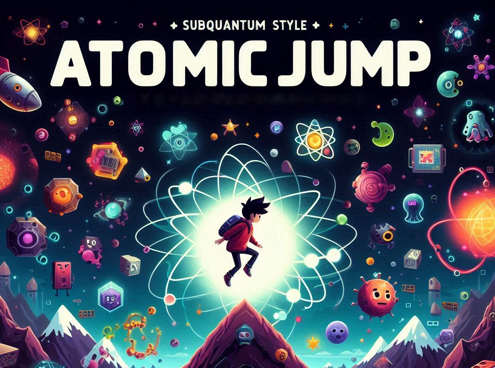

# AtomicJump

  

        
        

Juego de plataformas de ascensión vertical con caracteristicas roguelike (objetos, bonificadores, enemigos y generación procedural) y competitivo (pvp).

El juego consiste en un único nivel que no tiene final, el objetivo es llegar lo más alto posible. La puntuación final se calcula en base a la altura alcanzada, los enemigos eliminados y los objetos recogidos.

Cada partida es única, la generación de niveles es aleatoria y los objetos y enemigos que aparecen en cada nivel también. Todo esto gracias a la generación de una semilla aleatoria que determina el comportamiento de los algoritmos de generación procedural.

La temática del juego es la de un personaje subcuántico que debe de ascender por la estructura de un átomo, evitando las particulas subatómicas y recogiendo los objetos que le ayudarán a avanzar. Esta idea es la que giara todo el diseño artistico, de los objetos, enemigos y plataformas del juego.

- [AtomicJump](#atomicjump)
- [Instalación](#instalación)
- [Modos de juego](#modos-de-juego)
  - [Modo solitario](#modo-solitario)
  - [Modo semilla](#modo-semilla)
  - [Modo multijugador](#modo-multijugador)
- [Menus](#menus)
  - [Menu principal](#menu-principal)
  - [Menu de elección de personaje](#menu-de-elección-de-personaje)
  - [Menu de opciones](#menu-de-opciones)
  - [Menu de pausa](#menu-de-pausa)
- [Controles](#controles)
- [Plataformas](#plataformas)
  - [Lista de plataformas](#lista-de-plataformas)
    - [Bloques](#bloques)
    - [Paredes](#paredes)
    - [Plataformas](#plataformas-1)
- [Personajes](#personajes)
  - [Lista de personajes](#lista-de-personajes)
- [Enemigos](#enemigos)
  - [Lista de enemigos](#lista-de-enemigos)
- [Estadisticas](#estadisticas)
- [Objetos](#objetos)
  - [Divisas](#divisas)
  - [Cofres](#cofres)
  - [Bonificadores](#bonificadores)
  - [Modificadores de disparo](#modificadores-de-disparo)

# Instalación

WIP 🚧

# Modos de juego

## Modo solitario

En este modo de juego el jugador comienza una nueva partida (generando la correspondiente semilla aleatoria) y debe de ascender por las plataformas evitando los enemigos y recogiendo los objetos que le ayudarán a avanzar.

## Modo semilla

Este modo de juego es igual que el anterior, pero en lugar de generar una semilla aleatoria, el jugador puede introducir una semilla manualmente. Esto permite a los jugadores compartir semillas y competir por ver quien llega más lejos.

## Modo multijugador

En este modo de juego los jugadores compiten entre ellos en una partida en la que todos los jugadores comparten la misma semilla. Los jugadores entonces compiten por ver quien llega más lejos, jugando cada uno de forma local compartiendo la semilla con el resto de jugadores. Segun los jugadores van muriendo, se va generando una clasificación con la puntuación de cada jugador. Cuando todos los jugadores han muerto, se muestra la clasificación final y la partida termina.

# Menus

## Menu principal

El menu principal es el menu que se muestra al iniciar el juego. Desde aquí se puede acceder a los distintos modos de juego, al menu de elección de personaje y a las opciones del juego.

## Menu de elección de personaje

En este menu se puede elegir el personaje con el que se jugará la partida. Cada personaje tiene sus propias habilidades y características.

## Menu de opciones

En este menu se pueden configurar las opciones del juego, como el volumen de la música y los efectos de sonido, controles, etc.

## Menu de pausa

Este menu se muestra cuando el jugador pausa la partida. Desde aquí se puede reanudar la partida, ir al menu de opciones, volver al menu principal o salir del juego.

# Controles

Los controles del juego son los siguientes:

- 'A' para moverse a la izquierda.
- 'D' para moverse a la derecha.
- 'Espacio' para saltar.
- '->' para disparar a la derecha.
- '<-' para disparar a la izquierda.
- '↑' para disparar hacia arriba.
- '↓' para disparar hacia abajo.
- 'Esc' para abrir el menu de pausa.

# Plataformas

La idea es generar un conjunto de plataformas de un tamaño fijo y que se vayan cargando y descargando según el jugador avanza por el nivel. Esta parte estará controlada por la semilla y la generación procedural.

En cada plataforma hay varios sitios designados para la aparicion de objetos y enemigos en función del algoritmo procedural apareceran ahí o no (los objetos) o el tipo (enemigo). Habrá sitios designados para monedas (probabilidad alta), llaves (probabilidad baja). Cofre de monedas (probabilidad alta) y cofre de llaves (probabilidad baja). Bonificadores sin cofre (probabilidad baja)

Los enemigos aparecerán en sitios designados pero el tipo de enemigo será aleatorio.

## Lista de plataformas

### Bloques

- Bloque normal 1x2
- Bloque normal 1x3
- Bloque normal 1x4
- Bloque pinchos 1 1x2 (WIP)
- Bloque pinchos 2 1x2 (WIP)
- WIP 🚧

### Paredes

- Pared normal
- Pared izquierda con hueco 1
- WIP 🚧

### Plataformas

- Plataforma inicial
- Plataforma 1
- WIP 🚧

# Personajes

En un futuro se espera que el juego tenga varios personajes seleccionables, cada uno con sus propias habilidades y características.

## Lista de personajes

- Wilas: Personaje por defecto. No tiene habilidades especiales.
- WIP 🚧

# Enemigos

Los enemigos son personajes que aparecen a partir de cierta altura y que intentan matar al jugador. Los enemigos pueden ser de varios tipos y tener distintos comportamientos.

## Lista de enemigos

WIP 🚧

# Estadisticas

Las estadísticas son modificadores que afectan al comportamiento del personaje. Estas estadísticas se pueden modificar recogiendo objetos o bonificadores. Algunas de estas estadísticas se mostraran en un HUD, otras en un panel de estadísticas, otras en una lista de objetos y otras no se mostrarán en ningún sitio.

Las estadísticas de los personajes son las siguientes:

- Vida (HUD): Cantidad de vida del personaje. Si llega a 0, el personaje muere.
- Vida máxima (HUD): Cantidad máxima de vida del personaje.
- Suerte (Stats): Modificador de probabilidad de aparición de objetos.
- Velocidad (Stats): Velocidad a la que se mueve el personaje.
- Salto (Stats): Fuerza del salto del personaje.
- Tamaño (Stats): Tamaño del personaje.
- Multi-salto (Stats): Cantidad de saltos que puede hacer el personaje en el aire.
- Ataque (Stats): Daño que hace el personaje al disparar.
- Celeridad (Stats): Velocidad a la que el personaje dispara.
- Distancia (Stats): Distancia a la que llegan los disparos del personaje.
- Defensa (Stats): Reducción de daño que recibe el personaje.
- Modificadores disparo (List): Modificadores que afectan al disparo del personaje.
- WIP 🚧

En función del personaje que el jugador escoge, las estadísticas base del jugador varían.

# Objetos

Los objetos son elementos que aparecen de forma aleatoria en los sitios designados en las distintas plataformas y con los cuales el jugador puede interactuar. Los objetos pueden ser de cuatro tipos: divisas, cofres, bonificadores y modificadores de disparo.

## Divisas

- Moneda: Divisa básica del juego. Se usa para abrir cofres de monedas.
- Llaves: Divisa especial del juego. Se usa para abrir cofres de llaves.

## Cofres

- Cofre de monedas: Contiene uno o mas modificadores de estadísticas.
- Cofre de llaves: Contiene un modificador de disparo o estadistica especial.

## Bonificadores

- Bonificador de curación: Recupera vida del personaje.
- Bonificador de vida máxima: Aumenta la vida máxima del personaje.
- Bonificador de suerte: Aumenta la suerte del personaje.
- Bonificador de velocidad: Aumenta la velocidad del personaje.
- Bonificador de salto: Aumenta la fuerza del salto del personaje.
- Bonificador de tamaño: Reduce el tamaño del personaje.
- Bonificador de multi-salto: Aumenta la cantidad de saltos que puede hacer el personaje en el aire.
- Bonificador de ataque: Aumenta el daño que hace el personaje al disparar.
- Bonificador de celeridad: Aumenta la velocidad a la que el personaje dispara.
- Bonificador de distancia: Aumenta la distancia a la que llegan los disparos del personaje.
- Bonificador de defensa: Aumenta la reducción de daño que recibe el personaje.
- WIP 🚧

## Modificadores de disparo

- Disparo doble: Dispara dos proyectiles en lugar de uno.
- Disparo triple: Dispara tres proyectiles en lugar de uno, sustituyendo al disparo doble.
- Explosión: Los proyectiles explotan al impactar. La explosión hace daño a los enemigos cercanos.
- Rebote: Los proyectiles rebotan en las paredes. Hace menos daño.
- Perforante: Los proyectiles atraviesan a los enemigos. Hace menos daño.
- Ralentizador: Los proyectiles ralentizan a los enemigos.
- Veneno: Los proyectiles envenenan a los enemigos. Daño por segundo.
- Fantasma: Los proyectiles atraviesan a las plataformas. Ya no pueden rebotar. Hace menos daño.
- Brujula: Los proyectiles salen en las tres direcciones (arriba, derecha e izquierda).
- WIP 🚧
