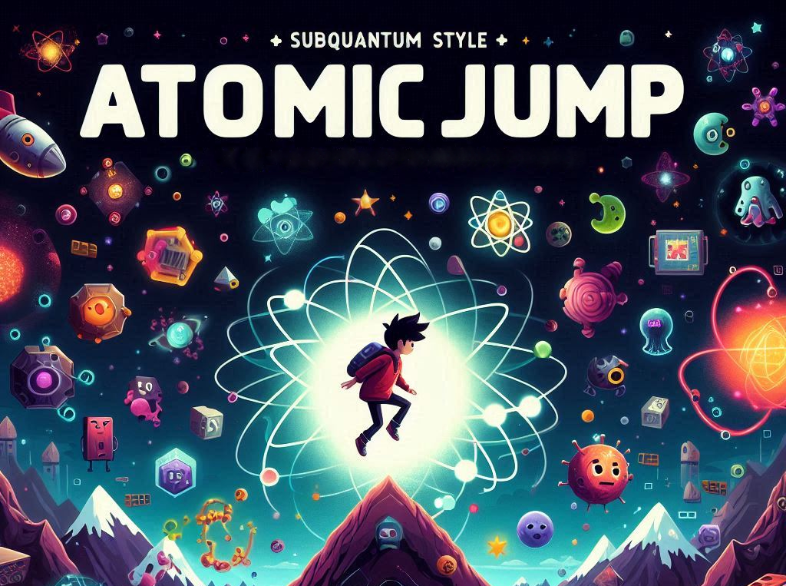

# AtomicJump

  

        
        
        

**AtomicJump** es un roguelike de plataformas vertical. Eres **Wilas**, una partícula consciente nacida en el núcleo de un átomo, y tu objetivo es escapar: ascender por las capas electrónicas **K, L, M y N** hasta alcanzar la ionización, mientras la **Decoherencia** sube desde abajo y colapsa todo lo que toca.

Cada partida empieza desde cero. Durante la ascensión construyes tu _build_ con **interacciones** de las fuerzas fundamentales, **observables** y **operadores**. Al decoherear (morir) vuelves al **Núcleo** con los **quarks** conseguidos para desbloquear mejoras permanentes, nuevos objetos, personajes y modos.

Cada partida tiene una **semilla** que la hace completamente reproducible: comparte la tuya y compara hasta dónde llega cada uno.

> Referencias: _Hades I y II_ y _The Binding of Isaac_, llevados a un plataformas vertical donde las salas son **tramos** y la prisa la pone una amenaza ascendente.

## Pilares

1. **Subir siempre**: la Decoherencia empuja, la altura puntúa.
2. **Cada partida es un build**: sinergias entre familias de fuerzas y observables.
3. **La semilla es sagrada**: misma semilla, mismo mundo.
4. **Progresión que se nota**: morir nunca es perder del todo.
5. **Imaginario cuántico coherente**: todo en el juego pertenece al mundo subatómico.
6. **Lo social ocurre fuera**: semillas y capturas de la tarjeta final.

## Documentación de diseño

| Documento                                            | Contenido                                                                    |
| ---------------------------------------------------- | ---------------------------------------------------------------------------- |
| [01 · Visión y pilares](docs/01-vision.md)           | Concepto, referencias, decisiones tomadas, alcance, dirección artística      |
| [02 · Universo y glosario](docs/02-universe.md)      | Premisa, regla de nombres código↔juego, glosario temático completo           |
| [03 · Estructura de partida](docs/03-run.md)         | Capas, bifurcaciones, Decoherencia, jefes, victoria, Modo Plasma, puntuación |
| [04 · Jugador](docs/04-player.md)                    | Controles, movimiento, combate, ranuras, estadísticas, personajes            |
| [05 · Mundo](docs/05-world.md)                       | Capas (biomas), tramos, reglas de diseño y generación procedural             |
| [06 · Economía](docs/06-economy.md)                  | Fotones, positrones, contenedores, Intercambio, divisas permanentes          |
| [07 · Objetos y mejoras](docs/07-items.md)           | Observables, operadores, interacciones, unificaciones, rarezas y pools       |
| [08 · Semillas](docs/08-seeds.md)                    | Reproducibilidad, tiradas direccionadas, monotonía de los modificadores      |
| [09 · Enemigos y jefes](docs/09-enemies.md)          | Bestiario por capa y jefes                                                   |
| [10 · Meta-progresión](docs/10-meta.md)              | El Núcleo, Campo de Higgs, Acelerador, personajes, Entropía, registros       |
| [11 · Interfaz](docs/11-ui.md)                       | Flujo de pantallas, HUD, tarjeta de partida, opciones, _game feel_           |
| [12 · Arquitectura](docs/12-architecture.md)         | Estructura técnica objetivo, convenciones y sistemas                         |
| [13 · Dirección de arte](docs/13-art-style.md) | Estilo "Luz sobre el vacío", paleta, reglas visuales, animación y generador `art/` · [propuesta visual](docs/assets/art-direction/index.html) |
| [99 · Ideas a futuro](docs/99-future-ideas.md) | Lo que queda fuera del roadmap: música, semilla diaria, guardar a mitad de partida, diálogos, Steam… |

El plan de desarrollo, fase a fase, está en el **[ROADMAP](ROADMAP.md)**.

## Estado actual

Prototipo temprano (v0.4): menú, nivel con plataformas aleatorias, recogida de monedas y llaves, pinchos, HUD, pausa y pantalla final con semilla. Los assets son **provisionales**. Consulta el [ROADMAP](ROADMAP.md) para ver en qué fase está el proyecto.

Con la Fase 1 (corrección de bugs) el prototipo sirve de referencia de comportamiento para el refactor:

- Cada partida empieza desde un estado limpio, se llegue al menú desde la pausa o desde la pantalla final.
- Cualquier semilla mostrada se puede volver a introducir (desde la Fase 3 son códigos como `K7QX-2MPA` o cualquier texto).
- Esc (o Start en el mando) pausa y también reanuda.
- Doble salto: los saltos cuánticos (`max_jumps`) cuentan el salto desde el suelo; solo se cuentan los saltos en el aire.
- Los pinchos hacen daño mientras se está en contacto, con 1 s de invulnerabilidad (parpadeo) tras cada golpe.
- La coherencia inicial y la máxima son 100.

La Fase 2 (refactor de fundamentos) mantiene esa jugabilidad sobre la arquitectura de [12 · Arquitectura](docs/12-architecture.md): partida en `RunManager`/`RunState`, estadísticas con modificadores, HUD por señales, transiciones entre pantallas, opciones guardadas (volumen e idioma), textos traducidos (español por defecto, también inglés), viewport 1280×720 y controles de mando.

La Fase 3 (sistema de semillas) hace la partida reproducible de verdad ([08 · Semillas](docs/08-seeds.md)): semillas `K7QX-2MPA` o de texto libre ("hola mundo"), hash estable propio y tiradas direccionadas para elegir los tramos y colocar los objetos, así que la misma semilla genera el mismo mundo en cualquier ejecución. El menú tiene botones **Aleatoria** y **Pegar**, y el HUD y la pantalla final muestran `semilla · g1` (con **Copiar semilla** en la pantalla final).

La Fase 4 (movimiento, cámara y Decoherencia) cambia la sensación de juego ([04 · Jugador](docs/04-player.md#movimiento) y [03 · Partida](docs/03-run.md#la-decoherencia-amenaza-ascendente)): aceleración, gravedad de caída, salto variable, _coyote time_, _jump buffer_, bajar de plataformas atravesables (Abajo + salto) y el **Túnel** (Shift), una esquiva con invulnerabilidad. La cámara sigue a Wilas y la prisa la pone la **Decoherencia**, que sube desde abajo, quita un 25 % de coherencia al tocarla y te devuelve a la última plataforma segura. Wilas ya tiene su aspecto final, generado por código y animado en el motor, con brillo. Para ajustar el movimiento hay una sala de pruebas (`world/debug/movement_test_room.tscn`).

La Fase 5 (tramos y generación de capas) sustituye la columna aleatoria del prototipo por una **Capa K generada** ([05 · Mundo](docs/05-world.md)): tramos de una pantalla diseñados con TileMapLayers sobre un tileset generado (niveles de energía, niveles virtuales atravesables, retícula y picos de potencial) y encadenados según sus entradas y salidas, con espejo y plataformas opcionales por semilla. Cada partida recorre la entrada de capa, dos **bifurcaciones** con el icono de su recompensa (al cruzar una salida la otra colapsa), un descanso y un jefe provisional; al salir por arriba se completa la capa. El fondo es la nube del orbital 1s calculada en un shader. Hay una plantilla de tramo con validador en el editor y una sala para jugar un tramo suelto (`world/debug/chunk_test_room.tscn`). La generación cambió, así que las semillas pasan a `g2`.

La Fase 6 (combate y enemigos) trae el **disparo** en 4 direcciones (flechas o stick derecho) con la Frecuencia, el Alcance y la Carga de Wilas; los proyectiles heredan algo de su velocidad, se detienen en las paredes y disparar hacia abajo en el aire frena la caída ([04 · Jugador](docs/04-player.md#disparo)). La Capa K se puebla con sus tres enemigos ([09 · Enemigos](docs/09-enemies.md)): el **electrón orbital**, el **neutrón libre** (que al morir decae en un electrón efímero) y la **partícula alfa** (que avisa y embiste). Aparecen en los huecos de los tramos según la semilla, sueltan fotones con tiradas direccionadas y los impactos y muertes dejan trazas de cámara de burbujas, con un _hitstop_ breve. La pantalla final cuenta los enemigos eliminados y la causa de la muerte. Hay una sala de pruebas de combate (`world/debug/combat_test_room.tscn`). La generación cambió: las semillas pasan a `g3`.

## Ejecutar el proyecto

1. Instala [Godot 4.7](https://godotengine.org/download).
2. Abre `project.godot` desde el gestor de proyectos.
3. Pulsa **F5**.

## Desarrollo

- Lint y formato: `pip install -r requirements-dev.txt`, después `gdformat .` y `gdlint .`.
- Tests (gdUnit4, _headless_): `GODOT_BIN=/ruta/a/godot addons/gdUnit4/runtest.sh --headless --ignoreHeadlessMode -a res://tests`.
- Exportar: presets `Windows Desktop` y `Linux` en `export_presets.cfg` (requieren las plantillas de exportación de la 4.7.2).
- La CI ejecuta lint y tests en cada PR. Convenciones y comandos completos en [AGENTS.md](AGENTS.md) y [12 · Arquitectura](docs/12-architecture.md#calidad).

## Controles (objetivo)

| Acción          | Teclado | Mando           |
| --------------- | ------- | --------------- |
| Moverse         | A / D   | Stick izquierdo |
| Saltar          | Espacio | A               |
| Bajar plataforma | S + Espacio | Abajo + A   |
| Disparar        | Flechas | Stick derecho   |
| Túnel (esquiva) | Shift   | RB              |
| Operador        | E       | LB              |
| Build           | Tab     | Select          |
| Pausa           | Esc     | Start           |

## Licencia

[GPLv3](LICENSE)
